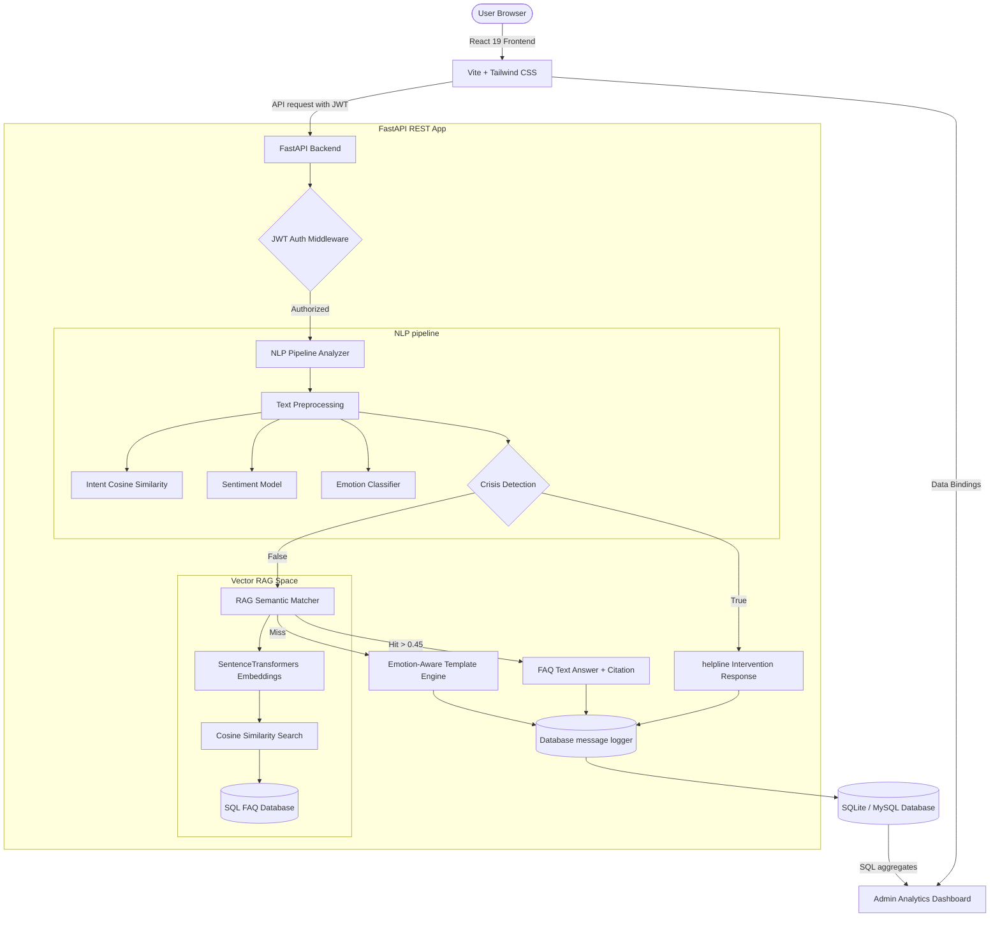

# MindMate AI: Industry-Grade Campus Mental Health & Wellness Portal

**MindMate AI** is a production-ready, highly optimized full-stack application designed to provide students with 24/7 mental wellness guidelines, stress management tools, mood-tracking logs, and secure conversational support. 

This project is built following **clean architecture (SOLID principles)** and designed to showcase placement-ready engineering skills across Full Stack Development, Natural Language Processing (NLP), and applied AI architectures.

---

## 🏗️ System Architecture

The workflow below demonstrates the request lifecycle, highlighting the hybrid NLP analysis pipeline and RAG (Retrieval-Augmented Generation) query routing:



---

## 🛠️ Technology Stack

### Frontend
- **React 19** & **Vite**: Ultra-fast build times and modern component design.
- **TypeScript**: Full static typing and schema verification.
- **Tailwind CSS**: Custom modern glassmorphic dashboard styling.
- **React Router Dom**: Client-side routing and protected paths.
- **React Query** (TanStack): Cached data-fetching and automatic state invalidation.
- **Chart.js** & **React-Chartjs-2**: High-performance dashboard visualizations.
- **Lucide React**: Clean vector icon toolkit.

### Backend
- **FastAPI**: Async, high-performance Python web framework.
- **Pydantic v2**: Direct request payload parsing and validation.
- **SQLAlchemy 2.0**: Declarative ORM supporting multi-database switches.
- **JWT & Passlib (Bcrypt)**: Secure authentication and password hashing.
- **Uvicorn**: Async ASGI server.

### AI & NLP Pipeline
- **Sentence-Transformers (`all-MiniLM-L6-v2`)**: Generates dense vector representations for semantic search.
- **HuggingFace Pipeline (`distilbert-base-uncased`)**: Performs deep sentiment and emotion analysis.
- **NLTK & Custom Regex Pipeline**: Implements tokenization, stopword filtering, lemmatization, and crisis detection.
- **Dual-mode Fallbacks**: Lexicon and rule-based fallback mode activate automatically if heavy models are loading, offline, or unavailable, guaranteeing 100% uptime.

---

## 🗄️ Database ER Schema

The database supports SQLite by default for simple zero-config testing and can be switched to MySQL in production.

- **`users`**: Unique identifier, credentials (bcrypt hash), role (`user`/`admin`), suspension status.
- **`chats`**: Title, user reference (foreign key, cascades deletion).
- **`messages`**: Text content, sender (`user`/`bot`), NLP metadata fields (sentiment, emotion, intent), RAG tracking (citation name, matched FAQ reference).
- **`mood_logs`**: Mood rating (1 to 5), descriptive journal notes, timestamp. Used to render student stress trends.
- **`faq_dataset`**: RAG query target containing wellness guide categories, questions, answers, and search keywords.
- **`feedback`**: 5-star student review scores and text comments attached to specific chatbot replies.
- **`activity_logs`**: System audit trail capturing logins, registration dates, and admin adjustments.

---

## 🚀 Getting Started

### Quick Start (Docker Compose)
To compile and launch both services, database schemas, and seeder data instantly:
```bash
docker-compose up --build
```
Access the application:
- Frontend Portal: `http://localhost:5173`
- Backend Swagger: `http://localhost:8000/docs`

---

### Manual Local Setup

#### 1. Backend Setup
```bash
# Navigate to workspace
cd backend

# Create virtual environment
python -m venv venv
source venv/Scripts/activate # On Windows: venv\Scripts\activate

# Install dependencies
pip install -r requirements.txt

# Seed the database (Creates tables and mock analytics logs)
python seed.py

# Start developer server
uvicorn backend.main:app --reload
```

#### 2. Frontend Setup
```bash
cd frontend

# Install packages
npm install

# Start Vite developer server
npm run dev
```

---

