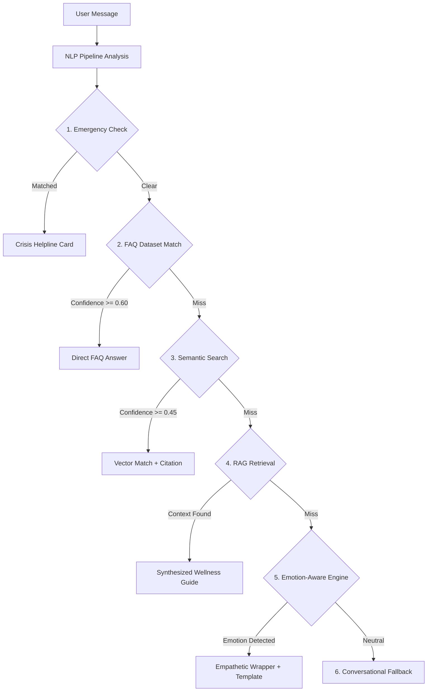
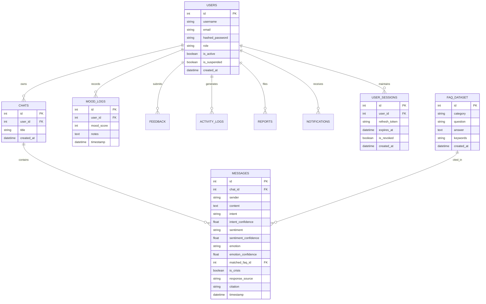

# MindMate AI - System Architecture & Technical Design

## 🌟 Architecture Overview

MindMate AI is designed adhering to modern **Clean Architecture** and **SOLID Principles**, separating concerns into isolated, decoupled layers:

1. **Presentation Layer (Frontend)**: React 19, TypeScript, Vite, Framer Motion, and Chart.js UI components.
2. **API & Routing Layer**: FastAPI REST endpoints handling request validation (Pydantic), routing, and response serialization.
3. **Security & Authentication Middleware**: JWT bearer token validation, OAuth2 password flows, refresh token rotation, and Role-Based Access Control (RBAC).
4. **AI & NLP Engine Layer**: Hybrid intelligence pipeline integrating spaCy / NLTK text processing, SentenceTransformers embedding generators, TF-IDF cosine similarity vector classifiers, and 6-tier response priority routing.
5. **Retrieval-Augmented Generation (RAG) Layer**: Vector Database abstraction supporting runtime switching between FAISS, ChromaDB, and raw NumPy vector similarity storage.
6. **Data Storage & Persistence Layer**: SQLAlchemy 2.0 ORM managing dynamic database connections between local SQLite (dev) and MySQL 8.0 (prod).

---

## 🔄 6-Tier Response Engine Flow

---

## 🗄️ Database Entity-Relationship (ER) Schema

